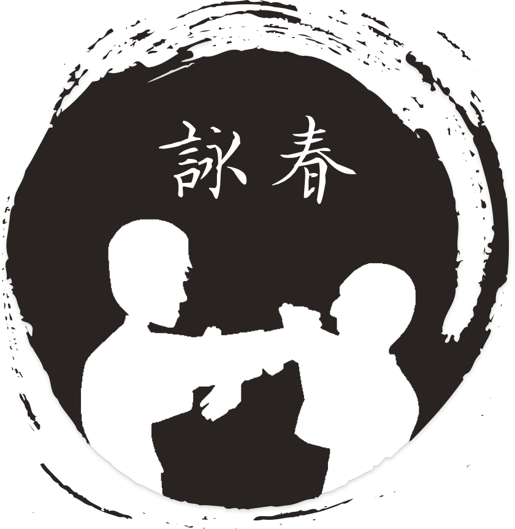

# Wing Chun App

Train your Wing Chun Stances with this awesome app!

## Getting Started

To get started:
```
git clone https://github.com/HYannick/PwtsApp.git
flutter packages get
flutter run
```

--------------------------------------------------------------------
This project is a starting point for a Flutter application.
A few resources to get you started if this is your first Flutter project:

- [Lab: Write your first Flutter app](https://flutter.io/docs/get-started/codelab)
- [Cookbook: Useful Flutter samples](https://flutter.io/docs/cookbook)

For help getting started with Flutter, view our 
[online documentation](https://flutter.io/docs), which offers tutorials, 
samples, guidance on mobile development, and a full API reference.
